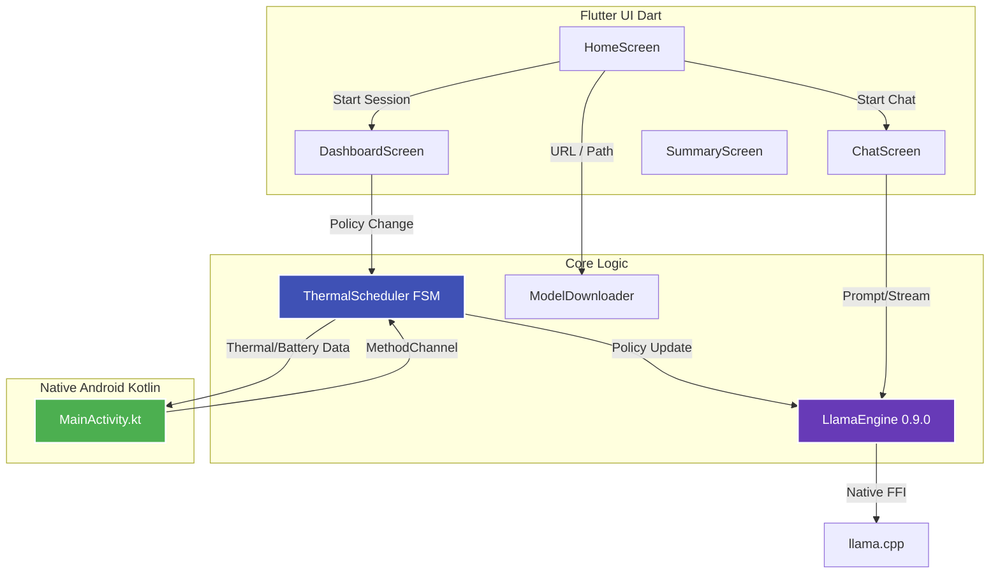

# ThermalPilot 🌡️🤖

> **A thermal-and-battery-aware on-device LLM inference scheduler and chat interface for Android.**

ThermalPilot dynamically adjusts thread count, quantization tier (INT4 ↔ INT8), and context length in real-time based on your Android device's SoC temperature and battery state. It keeps tokens/sec stable under thermal throttling instead of letting performance collapse, all while running a real-time live dashboard and an interactive on-device chat.

Built with **Flutter**, **Dart**, **Kotlin**, and **llama_cpp_dart (0.9.0-dev)**.

---

## ✨ Features

- **Adaptive Inference Scheduler**: A Finite State Machine (FSM) that monitors thermal zones and automatically scales back performance before the OS forcefully throttles the CPU.
- **Hot-Swapping Quantization**: Seamlessly switches between high-precision INT8 models (when cool) and low-memory INT4 models (when hot).
- **Interactive On-Device Chat**: A full chat interface with streaming tokens, typing indicators, context shifting, and live thermal badges. No internet required!
- **Built-in Model Downloader**: Paste a HuggingFace URL and download `.gguf` files directly into the app with a real-time progress bar and auto-resume support.
- **Live Telemetry Dashboard**: Real-time `fl_chart` graphs tracking Tokens Per Second (TPS), SoC Temperature, Battery Temperature, and Scheduler Policy states.
- **Benchmark Mode**: Compare the adaptive scheduler against a static "Baseline" mode over a 20-minute session and export the data to CSV.

---

## 🏗️ Architecture



### Scheduler State Machine

| State | Threads | Quant Tier | Context Length | Trigger Condition | Notes |
| :--- | :--- | :--- | :--- | :--- | :--- |
| **COOL** | `4` (Big cores) | **INT8** | `4096` | Default / Status 0 | Full performance |
| **WARM** | `3` (Reduced) | **INT8** | `2048` | Status 1 or > 39°C | Slight reduction |
| **HOT** | `2` (Little cores) | **INT4** | `1024` | Status 2 or > 42°C | Aggressive thermal savings |
| **CRITICAL** | `1` (Minimal) | **INT4** | `512` | Status 3/4 or > 45°C | Survival mode |

*Hysteresis is built-in: The scheduler requires 2 consecutive hotter readings to downgrade performance, and 3 consecutive cooler readings to upgrade, preventing rapid oscillation (thrashing).*

---

## 🚀 Setup & Installation

### Prerequisites

- **Flutter SDK**: `≥ 3.19`
- **Dart SDK**: `≥ 3.3`
- **Android Studio / NDK**: Required for building the Android APK.
- **Target Device**: ARM64 Android device (API 29+ recommended for `PowerManager.addThermalStatusListener`).

### 1. Clone & Install Dependencies

```bash
git clone https://github.com/LonelyGuy12/ThermalPilot.git
cd ThermalPilot
flutter pub get
```

### 2. Build and Install the APK

```bash
# Build the release APK
flutter build apk --release

# Install on connected device
adb install build/app/outputs/flutter-apk/app-release.apk

# OR run in debug mode for development
flutter run
```

### 3. In-App Setup (Downloading Models)

ThermalPilot can download models directly from HuggingFace. We recommend using **Qwen2.5-0.5B-Instruct**.

1. Open **ThermalPilot** on your phone.
2. Tap the **INT4 Model** card. A bottom sheet will appear.
3. Paste the HuggingFace URL for the `Q4_K_M` model (or use the pre-filled default) and tap **Download**.
   *URL: `https://huggingface.co/Qwen/Qwen2.5-0.5B-Instruct-GGUF/resolve/main/qwen2.5-0.5b-instruct-q4_k_m.gguf`*
4. Repeat for the **INT8 Model** card using the `Q8_0` model.
   *URL: `https://huggingface.co/Qwen/Qwen2.5-0.5B-Instruct-GGUF/resolve/main/qwen2.5-0.5b-instruct-q8_0.gguf`*

*(Note: If you only download one model, ThermalPilot will automatically use it for both tiers, allowing you to start sessions immediately!)*

---

## 📊 Using the App

### Chat Mode
Tap **"Chat with Model"** on the home screen to launch the interactive AI chat.
- **Fully On-Device**: No data leaves your phone.
- **Streaming UI**: Tokens appear in real-time.
- **Live Thermals**: The App Bar displays a badge indicating your phone's current thermal state.

### Benchmark Mode
1. Ensure models are downloaded.
2. Select either **ThermalPilot** (Adaptive Scheduler) or **Baseline** (Max threads, fixed INT8).
3. Tap **Start 20-min Session**.
4. Watch the live telemetry on the **Dashboard**.
5. Once the session ends, review the **Summary Screen** and export the run to a CSV file for analysis.

---

## 🛠️ Project Structure

```text
lib/
├── inference/
│   └── llama_engine.dart            # llama_cpp_dart 0.9.0 isolate-backed engine
├── native/
│   └── thermal_channel.dart         # MethodChannel for Android sensors
├── scheduler/
│   ├── session_logger.dart          # CSV logging & statistics
│   ├── thermal_models.dart          # Enums and state definitions
│   └── thermal_scheduler.dart       # FSM logic and sensor polling
├── ui/
│   ├── chat_screen.dart             # Interactive streaming chat UI
│   ├── dashboard_screen.dart        # Live fl_chart telemetry
│   ├── home_screen.dart             # Entry point & downloader UI
│   └── summary_screen.dart          # Post-benchmark results & CSV export
└── utils/
    └── model_downloader.dart        # HTTP robust downloader with auto-resume

android/app/src/main/kotlin/.../
└── MainActivity.kt                  # Kotlin: PowerManager API, sysfs parsing, BatteryManager
```

---

## ⚙️ Advanced Tuning

You can tweak the scheduler's behavior by modifying the constants at the top of [`lib/scheduler/thermal_scheduler.dart`](lib/scheduler/thermal_scheduler.dart):

```dart
const int kWarmStatusThreshold  = 2;  // PowerManager THERMAL_STATUS_MODERATE
const int kHotStatusThreshold   = 3;  // PowerManager THERMAL_STATUS_SEVERE
const int kCritStatusThreshold  = 4;  // PowerManager THERMAL_STATUS_CRITICAL

// Hysteresis
const int kDowngradeConsecutive = 2;  // Readings needed to downgrade performance
const int kUpgradeConsecutive   = 3;  // Readings needed to upgrade performance

// Context Window Scaling
const int kCoolCtxLen  = 4096;
const int kWarmCtxLen  = 2048;
const int kHotCtxLen   = 1024;
const int kCritCtxLen  = 512;
```

---

## 📄 License

This project is licensed under the MIT License.
Powered by [llama_cpp_dart](https://pub.dev/packages/llama_cpp_dart) and the incredible [llama.cpp](https://github.com/ggerganov/llama.cpp) project.
